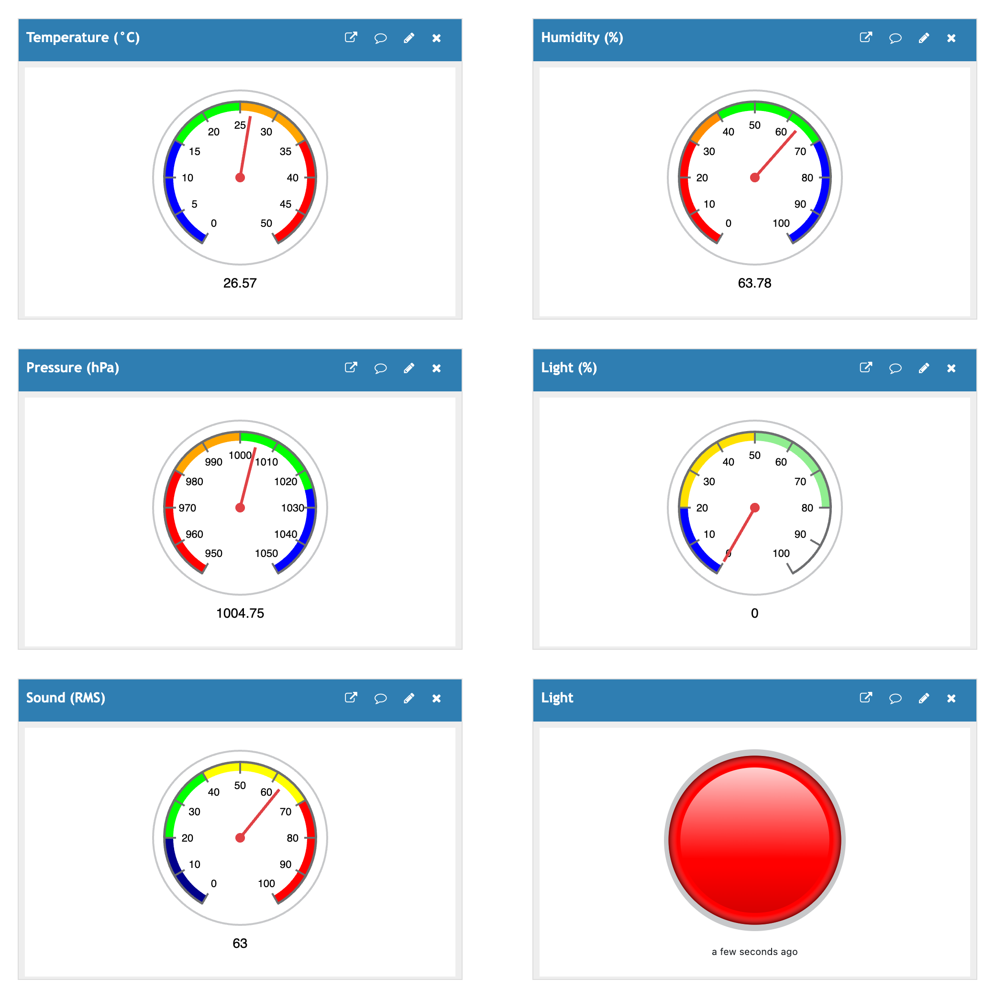

# Smart Environment Station

An ESP32-based project for comprehensive environmental monitoring featuring AHT20 temperature and humidity, BMP280 pressure, LDR light sensor, and sound RMS measurement. The system includes an OLED user interface with menu navigation using a button and potentiometer, LED and buzzer feedback, and cloud integration with ThingSpeak via HTTP or MQTT. Arduino Uno is also supported in a local-only mode without cloud connectivity.


## ThingSpeak Dashboard

Below is an example screenshot of the live ThingSpeak data:



## Features

- Sensors:
  - AHT20 Temperature and Humidity
  - BMP280 Barometric Pressure
  - LDR Light Intensity
  - Sound RMS Level
- OLED display with interactive menu navigation (button + potentiometer)
- LED and buzzer for user feedback and alerts
- Cloud data upload to ThingSpeak via HTTP or MQTT protocols
- Cross-board compatibility: ESP32 (full features) and Arduino Uno (local mode)

## Directory Structure

```
include/       # Header files for sensors and modules
lib/           # External libraries and dependencies
src/           # Source code files
platformio.ini # PlatformIO build configuration
```

## Pin Connection Table

| Component  | Board Pin | Description                      |
|------------|------------|--------------------------------|
| Button     | D4         | Menu navigation button          |
| LED        | D6         | Status LED                     |
| Buzzer     | D5         | Audio feedback buzzer           |
| Potentiometer | A0       | Menu navigation potentiometer   |
| LDR        | A3         | Light sensor analog input       |
| Sound      | A2         | Sound RMS analog input          |
| AHT20/BMP280/OLED | I2C SDA (GPIO 21) | I2C data line for sensors and display |
| AHT20/BMP280/OLED | I2C SCL (GPIO 22) | I2C clock line for sensors and display|

## Configuration

- Edit `cloud_config.h` to set your WiFi credentials and ThingSpeak API keys.
- Use the `USE_MQTT` flag in the configuration to select between HTTP and MQTT protocols for cloud communication.

## Getting Started

1. Install [PlatformIO](https://platformio.org/) and open the project.
2. Select your target board (ESP32 or Arduino Uno) in `platformio.ini`.
3. Build and upload the firmware.
4. Open the serial monitor to view real-time sensor data and system status.

## ThingSpeak Setup

1. Create a ThingSpeak account at [https://thingspeak.com](https://thingspeak.com).
2. Create a new channel with 6 fields:
   - Field 1: Temperature
   - Field 2: Humidity
   - Field 3: Pressure
   - Field 4: Light Intensity
   - Field 5: Sound RMS
   - Field 6: LED Status
3. Obtain the Write API Key and configure it in `cloud_config.h`.
4. Use the ThingSpeak dashboard to monitor your environmental data in real-time.

## Supported Boards

- **ESP32**: Full feature support including cloud connectivity and OLED UI.
- **Arduino Uno**: Local monitoring only; no cloud upload functionality.

## Notes

- Update interval for sensor readings and cloud uploads should be set to 15 seconds or more.
- OLED display refresh interval is set to 500 milliseconds for smooth UI updates.
- Calibrate sensor thresholds as needed for accurate readings and alerts.

## License


